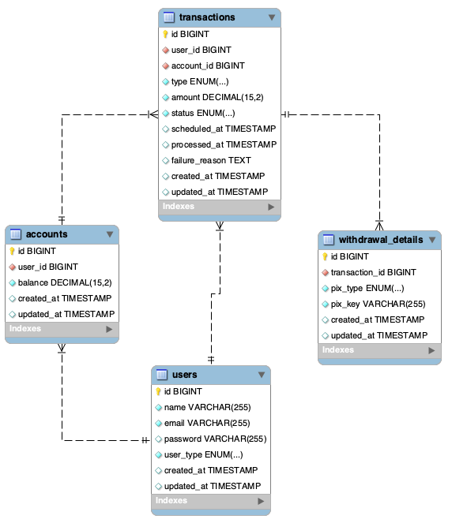

# User Withdrawal Control

Sistema web completo de controle financeiro com arquitetura de microsserviços, desenvolvido para gerenciar contas digitais, depósitos e saques via PIX. Utiliza PHP Hyperf 3 no backend e React com shadcn/ui no frontend.

## 🏗️ Arquitetura

O projeto segue uma arquitetura de microsserviços containerizada com Docker, incluindo:

- **Backend**: PHP Hyperf 3 com autenticação JWT
- **Frontend**: React 18 com TypeScript e shadcn/ui
- **Banco de Dados**: MySQL 8.0
- **Cache**: Redis 7
- **Reverse Proxy**: Nginx
- **Containerização**: Docker e Docker Compose

## 🚀 Stack Tecnológica

### Backend
- **PHP Hyperf 3**: Framework moderno para PHP com suporte a Swoole
- **MySQL 8.0**: Banco de dados relacional para persistência de dados
- **Redis 7**: Cache e armazenamento de sessões
- **JWT**: Autenticação baseada em tokens
- **Docker**: Containerização do ambiente

### Frontend
- **React 18**: Biblioteca para interfaces de usuário
- **TypeScript**: Tipagem estática para JavaScript
- **shadcn/ui**: Biblioteca de componentes modernos e acessíveis
- **Tailwind CSS**: Framework CSS utilitário
- **React Router**: Roteamento client-side
- **Lucide React**: Ícones modernos

### Infraestrutura
- **Docker & Docker Compose**: Orquestração de containers
- **Nginx**: Reverse proxy e load balancer
- **MySQL**: Banco de dados principal
- **Redis**: Cache e filas

## 📋 Funcionalidades

### 🔐 Módulo de Autenticação
- ✅ Cadastro de usuários com tipos (CLIENTE/MASTER)
- ✅ Login com JWT
- ✅ Validação de tokens
- ✅ Proteção de rotas

### 👤 Perfil CLIENTE
- ✅ **Dashboard e Saldo**: Visualização do valor atual disponível na conta
- ✅ **Módulo de Depósito**: Adicionar fundos à conta (crédito imediato)
- ✅ **Módulo de Saque**:
  - Saque Imediato: Débito instantâneo + validação de saldo
  - Saque Agendado: Agendamento até 7 dias (não debita no momento)
  - Cancelamento de Saques Agendados: Cancelar saques pendentes
- ✅ **Extrato**: Histórico completo de transações com filtros e paginação
- ✅ **Exportação Excel**: Exportar extrato de transações em formato Excel
- ✅ **Suporte PIX**: Saques via chave PIX (EMAIL, PHONE, CPF, RANDOM)
- ✅ **Máscara Monetária**: Formatação automática de valores em reais
- ✅ **Notificações Toast**: Feedback visual para ações do usuário
- ✅ **Interface Responsiva**: Design moderno com shadcn/ui

### 👑 Perfil MASTER
- ✅ **Dashboard Administrativo**: Painel com estatísticas em tempo real
- ✅ **Total de Clientes**: Contagem de clientes cadastrados no sistema
- ✅ **Total de Fundos**: Saldo total de todas as contas do banco
- ✅ **Saques Agendados**: Total de saques pendentes de todos os usuários
- ✅ **Transações Recentes**: Últimas 4 transações de todos os usuários
- ✅ **Gestão de Clientes**: Listagem, visualização, edição e cadastro de clientes
- ✅ **Cadastro de Clientes**: Formulário simplificado (apenas nome e email)
- ✅ **Primeiro Acesso**: Cliente define sua própria senha no primeiro login
- ✅ **Paginação**: Sistema de paginação para listagem de clientes
- ✅ **Filtros e Busca**: Busca por nome/email e ordenação
- ✅ **Navegação Intuitiva**: Botões de voltar e editar nos headers
- ✅ **Módulo de Transações**: Listagem completa de todas as transações do sistema
- ✅ **Filtros Avançados**: Busca por cliente, tipo, status e ordenação
- ✅ **Paginação Robusta**: Sistema completo com navegação por páginas
- ✅ **Interface Consistente**: Design alinhado com outros módulos
- ✅ **Exportação Excel**: Geração de planilhas com dados filtrados

### 🎨 Interface do Usuário
- ✅ Página de login responsiva
- ✅ Página de cadastro com validação
- ✅ Dashboard com sidebar e navbar
- ✅ Design system consistente com shadcn/ui
- ✅ Interface moderna e acessível
- ✅ Modo escuro/claro

## 🛠️ Instalação e Configuração

### Pré-requisitos
- Docker
- Docker Compose
- Git

### 1. Clone o repositório
```bash
git clone <url-do-repositorio>
cd user-withdrawal-control
```

### 2. Configure as variáveis de ambiente
Crie um arquivo `.env` na raiz do projeto (opcional, as configurações padrão funcionam para desenvolvimento):

```env
# Backend
JWT_SECRET=your-super-secret-jwt-key-change-in-production
DB_PASSWORD=app_password

# Frontend
REACT_APP_API_URL=http://localhost/api
```

### 3. Inicie os serviços
```bash
docker-compose up -d
```

### 4. Execute o script de configuração
```bash
# Script automatizado que executa migrations e seeders
./setup.sh
```

### 5. Execute o seed de dados de teste
```bash
# Criar dados de teste (1 master + 4 clientes com transações)
docker-compose exec backend php bin/hyperf.php db:seed
```

### 6. Acesse a aplicação
- **Frontend**: http://localhost:3000
- **API**: http://localhost:9501
- **MySQL**: localhost:3306
- **Redis**: localhost:6379

## 🔑 Credenciais de Teste

Após executar o seed de dados, você pode usar as seguintes credenciais para testar o sistema:

### 👑 Master (Administrador)
- **Email**: `master@exemplo.com`
- **Senha**: `123456`
- **Acesso**: Dashboard administrativo completo

### 👤 Clientes de Teste

| Nome | Email | Senha | Saldo Inicial |
|------|-------|-------|--------------|
| João Silva | `joao@exemplo.com` | `123456` | Variável |
| Maria Santos | `maria@exemplo.com` | `123456` | Variável |
| Pedro Oliveira | `pedro@exemplo.com` | `123456` | Variável |
| Ana Costa | `ana@exemplo.com` | `123456` | Variável |

> **Nota**: As credenciais de teste também estão disponíveis na página de login em um box discreto.

### 📊 Dados de Teste

Cada cliente possui:
- ✅ Conta com saldo variável
- ✅ Histórico de transações (depósitos e saques)
- ✅ Detalhes PIX associados aos saques
- ✅ Transações distribuídas nos últimos 3 dias

## 📊 Modelos de Dados

### 🗄️ Diagrama ER do Banco de Dados



### 🏦 Estrutura do Banco de Dados

#### **users** - Usuários do Sistema
- `id` - Identificador único
- `name` - Nome completo
- `email` - Email único
- `password` - Senha hashada
- `user_type` - Tipo de acesso (CLIENTE/MASTER)
- `created_at` / `updated_at` - Timestamps

#### **accounts** - Contas Digitais
- `id` - Identificador único
- `user_id` - Referência ao usuário
- `balance` - Saldo monetário (decimal 15,2)
- `created_at` / `updated_at` - Timestamps

#### **transactions** - Histórico de Transações
- `id` - Identificador único
- `user_id` - Referência ao usuário
- `account_id` - Referência à conta
- `type` - Tipo (DEPOSITO/SAQUE)
- `amount` - Valor da transação
- `status` - Status (PENDENTE/PROCESSADO/FALHOU/CANCELADO)
- `scheduled_at` - Data de agendamento (saques)
- `processed_at` - Data de processamento
- `failure_reason` - Motivo da falha
- `created_at` / `updated_at` - Timestamps

#### **withdrawal_details** - Detalhes de Saque PIX
- `id` - Identificador único
- `transaction_id` - Referência à transação
- `pix_type` - Tipo PIX (EMAIL/PHONE/CPF/RANDOM)
- `pix_key` - Chave PIX
- `created_at` / `updated_at` - Timestamps

## 🔌 API Endpoints

### 🔐 Autenticação
```http
POST /api/auth/register
POST /api/auth/login
POST /api/auth/set-password
GET  /api/auth/me
```

### 💰 Conta (Protegido - Cliente)
```http
GET /api/client/account/balance     # Consultar saldo
GET /api/client/account/info        # Informações da conta
```

### 💸 Transações (Protegido - Cliente)
```http
POST /api/client/transactions/deposit         # Realizar depósito
POST /api/client/transactions/withdraw        # Realizar saque
POST /api/client/transactions/cancel-scheduled # Cancelar saque agendado
GET  /api/client/transactions/statement       # Consultar extrato
GET  /api/client/transactions/export-excel    # Exportar extrato para Excel
GET  /api/client/transactions/recent          # Transações recentes (dashboard)
```

### 👑 Administração (Protegido - Master)
```http
GET /api/master/transactions/stats    # Estatísticas administrativas
GET /api/master/transactions/recent   # Transações recentes de todos os usuários
GET /api/master/transactions/list     # Listar todas as transações com filtros e paginação
GET /api/master/transactions/export-excel # Exportar transações para Excel
GET /api/master/clients/list          # Listar clientes com paginação
POST /api/master/clients/create       # Cadastrar novo cliente
GET /api/master/clients/{id}          # Visualizar detalhes do cliente
PUT /api/master/clients/{id}          # Editar informações do cliente
```

### 📝 Exemplos de Uso

#### **Login**
```bash
curl -X POST http://localhost:8080/api/auth/login \
  -H "Content-Type: application/json" \
  -d '{"email": "cliente@exemplo.com", "password": "123456"}'
```

#### **Consultar Saldo (Cliente)**
```bash
curl -X GET http://localhost:8080/api/client/account/balance \
  -H "Authorization: Bearer [TOKEN]"
```

#### **Realizar Depósito (Cliente)**
```bash
curl -X POST http://localhost:8080/api/client/transactions/deposit \
  -H "Authorization: Bearer [TOKEN]" \
  -H "Content-Type: application/json" \
  -d '{"amount": 500.00}'
```

#### **Realizar Saque Imediato (Cliente)**
```bash
curl -X POST http://localhost:8080/api/client/transactions/withdraw \
  -H "Authorization: Bearer [TOKEN]" \
  -H "Content-Type: application/json" \
  -d '{"amount": 200.00, "pix_type": "EMAIL", "pix_key": "teste@exemplo.com"}'
```

#### **Realizar Saque Agendado (Cliente)**
```bash
curl -X POST http://localhost:8080/api/client/transactions/withdraw \
  -H "Authorization: Bearer [TOKEN]" \
  -H "Content-Type: application/json" \
  -d '{"amount": 100.00, "pix_type": "EMAIL", "pix_key": "teste@exemplo.com", "scheduled_at": "2025-10-25 10:00:00"}'
```

#### **Consultar Extrato (Cliente)**
```bash
curl -X GET http://localhost:8080/api/client/transactions/statement \
  -H "Authorization: Bearer [TOKEN]"
```

#### **Exportar Extrato para Excel (Cliente)**
```bash
curl -X GET "http://localhost:8080/api/client/transactions/export-excel?type=all&status=all" \
  -H "Authorization: Bearer [TOKEN]" \
  -o extrato_transacoes.xlsx
```

#### **Consultar Transações Recentes (Cliente)**
```bash
curl -X GET "http://localhost:8080/api/client/transactions/recent?limit=4&days=30" \
  -H "Authorization: Bearer [TOKEN]"
```

#### **Cancelar Saque Agendado (Cliente)**
```bash
curl -X POST http://localhost:8080/api/client/transactions/cancel-scheduled \
  -H "Authorization: Bearer [TOKEN]" \
  -H "Content-Type: application/json" \
  -d '{"transaction_id": 123}'
```

#### **Consultar Estatísticas Administrativas (Master)**
```bash
curl -X GET http://localhost:8080/api/master/transactions/stats \
  -H "Authorization: Bearer [TOKEN]"
```

#### **Consultar Transações Recentes (Master)**
```bash
curl -X GET "http://localhost:8080/api/master/transactions/recent?limit=4&days=30" \
  -H "Authorization: Bearer [TOKEN]"
```

#### **Listar Todas as Transações (Master)**
```bash
curl -X GET "http://localhost:8080/api/master/transactions/list?page=1&limit=10&search=&type=&status=&sort_by=created_at&sort_order=desc" \
  -H "Authorization: Bearer [TOKEN]"
```

#### **Exportar Transações para Excel (Master)**
```bash
curl -X GET "http://localhost:8080/api/master/transactions/export-excel?search=&type=&status=" \
  -H "Authorization: Bearer [TOKEN]" \
  --output transacoes_master.xlsx
```

#### **Listar Clientes (Master)**
```bash
curl -X GET "http://localhost:8080/api/master/clients/list?page=1&limit=10" \
  -H "Authorization: Bearer [TOKEN]"
```

#### **Cadastrar Cliente (Master)**
```bash
curl -X POST http://localhost:8080/api/master/clients/create \
  -H "Authorization: Bearer [TOKEN]" \
  -H "Content-Type: application/json" \
  -d '{"name": "João Silva", "email": "joao@exemplo.com"}'
```

#### **Definir Senha Inicial (Cliente)**
```bash
curl -X POST http://localhost:8080/api/auth/set-password \
  -H "Content-Type: application/json" \
  -d '{"email": "joao@exemplo.com", "password": "123456"}'
```

## 📋 Regras de Negócio

### 💰 Operações Financeiras

#### **Depósitos**
- ✅ Valor deve ser maior que zero
- ✅ Crédito imediato na conta
- ✅ Transação marcada como PROCESSADO
- ✅ Atualização automática do saldo

#### **Saques Imediatos**
- ✅ Valor deve ser maior que zero
- ✅ Validação de saldo suficiente
- ✅ Débito imediato na conta
- ✅ Transação marcada como PROCESSADO
- ✅ Detalhes PIX obrigatórios

#### **Saques Agendados**
- ✅ Data de agendamento deve ser futura
- ✅ Limite máximo de 7 dias
- ✅ Valor NÃO é debitado no agendamento
- ✅ Transação marcada como PENDENTE
- ✅ Processamento automático via CRON (diariamente às 6:00 AM)
- ✅ Cancelamento permitido até processamento
- ✅ Status CANCELADO quando cancelado pelo usuário
- ✅ Status FALHOU quando saldo insuficiente no processamento

#### **Validações Gerais**
- ✅ Saldo nunca pode ser negativo
- ✅ Validação de saldo no momento do saque
- ✅ Chave PIX obrigatória para saques
- ✅ Formatação monetária brasileira (R$ 1.000,00)

### 🔐 Segurança
- ✅ Autenticação JWT obrigatória
- ✅ Tokens com expiração (1 hora)
- ✅ Validação de permissões por perfil
- ✅ Senhas hashadas com bcrypt
- ✅ Validação de entrada em todas as rotas
- ✅ Suporte a usuários sem senha (primeiro acesso)
- ✅ Verificação segura de senhas null

### 📊 Dados de Teste
- **Master**: `master@exemplo.com` / `123456`
- **João Silva**: `joao@exemplo.com` / `123456` (Saldo: Variável)
- **Maria Santos**: `maria@exemplo.com` / `123456` (Saldo: Variável)
- **Pedro Oliveira**: `pedro@exemplo.com` / `123456` (Saldo: Variável)
- **Ana Costa**: `ana@exemplo.com` / `123456` (Saldo: Variável)

### 🔧 Comandos de Migrations e Seeders

#### Migrations
```bash
# Executar migrations
docker-compose exec backend php bin/hyperf.php migrate

# Criar nova migration
docker-compose exec backend php bin/hyperf.php gen:migration nome_da_migration

# Ver status das migrations
docker-compose exec backend php bin/hyperf.php migrate:status

# Rollback da última migration
docker-compose exec backend php bin/hyperf.php migrate:rollback
```

#### Seeders
```bash
# Executar seeders
docker-compose exec backend php bin/hyperf.php db:seed

# Criar novo seeder
docker-compose exec backend php bin/hyperf.php gen:seeder NomeSeeder
```

> **Importante**: O seed `TestDataSeeder` limpa completamente o banco antes de criar novos dados de teste. Use com cuidado em produção!

## 📁 Estrutura do Projeto

```
user-withdrawal-control/
├── backend/                 # API PHP Hyperf 3
│   ├── app/
│   │   ├── Controller/      # Controladores da API
│   │   │   ├── AuthController.php      # Autenticação
│   │   │   ├── AbstractController.php  # Controller base
│   │   │   ├── Client/                 # Controladores do cliente
│   │   │   │   ├── AccountController.php   # Operações de conta
│   │   │   │   └── TransactionController.php # Depósitos e saques
│   │   │   └── Master/                 # Controladores do master
│   │   │       ├── ClientController.php    # Gestão de clientes
│   │   │       └── TransactionController.php # Dashboard e estatísticas
│   │   ├── Request/          # Form Requests de validação
│   │   │   ├── CreateClientRequest.php         # Validação de criação de cliente
│   │   │   ├── UpdateClientRequest.php         # Validação de atualização de cliente
│   │   │   ├── DepositRequest.php              # Validação de depósito
│   │   │   ├── WithdrawRequest.php             # Validação de saque
│   │   │   └── CancelScheduledWithdrawalRequest.php # Validação de cancelamento
│   │   ├── Middleware/       # Middlewares customizados
│   │   │   ├── LoadUserAccountMiddleware.php   # Carrega conta do usuário
│   │   │   └── AuthMiddleware.php               # Autenticação JWT
│   │   ├── Helper/           # Helpers utilitários
│   │   │   └── DateTimeHelper.php              # Helper de data/hora com timezone
│   │   ├── Traits/           # Traits reutilizáveis
│   │   │   └── HasAuthenticatedUser.php        # Trait para acesso ao usuário autenticado
│   │   └── Model/          # Modelos de dados
│   │       ├── User.php                # Usuários
│   │       ├── Account.php             # Contas digitais
│   │       ├── Transaction.php         # Transações
│   │       └── WithdrawalDetails.php   # Detalhes PIX
│   ├── config/             # Configurações do Hyperf
│   │   ├── autoload/
│   │   │   ├── databases.php          # Configuração MySQL
│   │   │   ├── redis.php              # Configuração Redis
│   │   │   └── jwt.php                # Configuração JWT
│   │   └── routes.php                 # Rotas da API
│   ├── migrations/         # Migrations do banco de dados
│   │   ├── create_users_table.php
│   │   ├── add_user_type_to_users_table.php
│   │   ├── create_accounts_table.php
│   │   ├── create_transactions_table.php
│   │   └── create_withdrawal_details_table.php
│   ├── seeders/            # Seeders para dados iniciais
│   │   └── user_seeder.php            # Usuários de teste
│   ├── Dockerfile
│   └── composer.json
├── frontend/               # Interface React
│   ├── src/
│   │   ├── components/     # Componentes reutilizáveis
│   │   │   ├── ui/         # Componentes shadcn/ui
│   │   │   │   ├── button.tsx         # Botão
│   │   │   │   ├── card.tsx           # Card
│   │   │   │   ├── input.tsx          # Input
│   │   │   │   ├── select.tsx         # Select
│   │   │   │   ├── badge.tsx          # Badge
│   │   │   │   ├── pagination.tsx     # Paginação
│   │   │   │   ├── date-picker.tsx    # Seletor de data
│   │   │   │   ├── input-group.tsx    # Grupo de input
│   │   │   │   ├── confirmation-modal.tsx # Modal de confirmação
│   │   │   │   ├── dialog.tsx         # Modal/Dialog
│   │   │   │   └── export-modal.tsx   # Modal de exportação
│   │   │   ├── layout/     # Componentes de layout
│   │   │   │   ├── Sidebar.tsx        # Barra lateral
│   │   │   │   └── Navbar.tsx         # Barra superior
│   │   │   ├── theme-provider.tsx     # Provedor de tema
│   │   │   └── theme-toggle.tsx       # Toggle dark/light
│   │   ├── pages/          # Páginas da aplicação
│   │   │   ├── Login.tsx              # Página de login
│   │   │   ├── Register.tsx           # Página de cadastro
│   │   │   ├── DashboardRouter.tsx    # Roteador de dashboards
│   │   │   ├── Client/                # Páginas do cliente
│   │   │   │   ├── Dashboard.tsx      # Dashboard do cliente
│   │   │   │   ├── DepositPage.tsx    # Página de depósito
│   │   │   │   ├── WithdrawPage.tsx   # Página de saque
│   │   │   │   └── StatementPage.tsx  # Página de extrato
│   │   │   └── Master/                # Páginas do master
│   │   │       └── Dashboard.tsx      # Dashboard administrativo
│   │   ├── hooks/          # Hooks customizados
│   │   │   ├── useAuth.ts             # Hook de autenticação
│   │   │   └── useExport.ts           # Hook de exportação
│   │   ├── lib/            # Utilitários
│   │   │   └── utils.ts               # Funções utilitárias
│   │   ├── helpers/        # Helpers específicos
│   │   │   └── currency.ts            # Formatação monetária
│   │   ├── utils/          # Utilitários específicos
│   │   │   └── api.ts                 # Configuração da API
│   │   └── App.tsx         # Componente principal
│   ├── public/
│   ├── Dockerfile
│   └── package.json
├── nginx/                  # Configuração do Nginx
│   └── nginx.conf
├── docker-compose.yml      # Orquestração dos serviços
├── setup.sh               # Script de configuração automática
└── README.md
```

## 🆕 Melhorias Recentes

### ✅ Form Requests e Validação Centralizada
- **CreateClientRequest**: Validação de criação de clientes
- **UpdateClientRequest**: Validação de atualização de clientes
- **DepositRequest**: Validação de depósitos
- **WithdrawRequest**: Validação de saques com timezone correto
- **CancelScheduledWithdrawalRequest**: Validação de cancelamento de saques agendados
- **Validação customizada**: Verificação de email único no update
- **Timezone Brasil**: Horário fixo às 06:00 AM para saques agendados
- **Mensagens personalizadas**: Feedback em português para todas as validações

### ✨ Módulo de Gestão de Clientes (Master)
- **CRUD completo**: Listagem, visualização, edição e cadastro de clientes
- **Cadastro simplificado**: Apenas nome e email (senha definida no primeiro acesso)
- **Sistema de primeiro acesso**: Cliente define sua própria senha no primeiro login
- **Paginação avançada**: Sistema robusto com navegação por páginas
- **Filtros e busca**: Busca por nome/email e ordenação por data/nome
- **Navegação intuitiva**: Botões de voltar e editar nos headers das páginas
- **Formulários responsivos**: Layout em grade com campos organizados
- **Validação em tempo real**: Feedback imediato para o usuário

### 📊 Módulo de Transações Master
- **Listagem completa**: Visualização de todas as transações do sistema
- **Filtros avançados**: Busca por cliente, tipo (DEPOSITO/SAQUE), status e ordenação
- **Paginação robusta**: Sistema completo com navegação por páginas e ellipsis
- **Interface consistente**: Design alinhado com outros módulos do sistema
- **Cards informativos**: Exibição clara de dados com ícones coloridos por tipo/status
- **Botão "Ver Cliente"**: Navegação direta para detalhes do cliente
- **Informações detalhadas**: PIX, datas formatadas, motivos de falha
- **Header limpo**: Interface simplificada sem informações redundantes
- **Exportação Excel**: Geração de planilhas com todos os dados filtrados

### 🔐 Sistema de Autenticação Aprimorado
- **Suporte a usuários sem senha**: Cadastro pelo master sem definir senha
- **Primeiro acesso seguro**: Cliente define senha no primeiro login
- **Verificação segura**: Tratamento correto de senhas null
- **Endpoint de definição de senha**: `/api/auth/set-password` para primeiro acesso
- **Mensagens claras**: Feedback adequado para diferentes cenários de login

### 🎨 Interface e UX Melhoradas
- **Botões de limpeza de filtros**: X no campo de busca e botão "Limpar" geral
- **Layout consistente**: Formulários seguem padrão estabelecido
- **Navegação otimizada**: Headers com ações contextuais
- **Remoção de elementos desnecessários**: Tag "Cliente" removida da listagem
- **Responsividade aprimorada**: Layouts adaptáveis para diferentes telas

### 🔧 Refatoração da Arquitetura
- **Separação de controladores**: Client/ e Master/ para melhor organização
- **AbstractController**: Centralização da lógica comum (getUserFromToken)
- **Rotas organizadas**: Prefixos consistentes em todas as rotas
- **Estrutura de pastas**: Frontend organizado por tipo de usuário
- **Banco de dados atualizado**: Campo password permite NULL, status CANCELADO adicionado
- **Correção de conflitos de rotas**: Centralização no routes.php para evitar conflitos
- **Arquitetura de rotas consistente**: Padrão unificado para todos os módulos
- **DateTimeHelper**: Centralização de operações de data/hora com timezone Brasil
- **LoadUserAccountMiddleware**: Middleware para carregar conta do usuário autenticado
- **HasAuthenticatedUser trait**: Trait para acesso seguro ao usuário e conta autenticados
- **Form Requests**: Validação centralizada e reutilizável em Form Requests

### 🐛 Correções e Melhorias
- **Loop infinito resolvido**: Substituição de window.location.href por navigate()
- **Redirecionamentos consistentes**: Uso do React Router em toda aplicação
- **Navegação com replace**: Evita acúmulo desnecessário no histórico
- **Tratamento de erros**: Mensagens claras para usuários sem senha
- **Validação robusta**: Verificação segura de senhas null
- **Timezone correto**: Horário fixo às 06:00 AM para saques agendados
- **Formatação de datas**: Datas formatadas com timezone Brasil corretamente
- **Validação de email único**: Validação customizada que exclui o próprio ID no update

## 🚀 Status do Projeto

### ✅ Implementado (Perfil CLIENTE)
- **Autenticação completa** com JWT
- **Sistema de contas digitais** com saldo
- **Depósitos imediatos** com validação
- **Saques imediatos** com validação de saldo
- **Saques agendados** (até 7 dias)
- **Processamento automático de saques** via CRON
- **Notificações por email** automáticas
- **Cancelamento de saques agendados** com confirmação
- **Extrato completo** com filtros e paginação
- **Exportação Excel** com PhpSpreadsheet
- **Transações recentes** no dashboard (4 transações)
- **Suporte PIX** (EMAIL, PHONE, CPF, RANDOM)
- **Máscara monetária** para valores em reais
- **Notificações toast** para feedback
- **Interface moderna** com shadcn/ui
- **Modo escuro/claro**
- **Design responsivo** e acessível
- **Migrations e seeders** automatizados
- **API REST completa** documentada
- **Lógica centralizada** no modelo Account
- **Navegação consistente** com prefixos /client

### ✅ Implementado (Perfil MASTER)
- **Dashboard administrativo** com estatísticas em tempo real
- **Total de clientes** cadastrados no sistema
- **Total de fundos** de todas as contas
- **Total de saques agendados** de todos os usuários
- **Transações recentes** de todos os usuários (4 transações)
- **Interface consistente** com o dashboard do cliente
- **Navegação consistente** com prefixos /master
- **API REST** para dados administrativos
- **Gestão completa de clientes** com CRUD
- **Cadastro simplificado** de clientes (nome e email)
- **Sistema de primeiro acesso** para definição de senha
- **Paginação avançada** para listagem de clientes
- **Filtros e busca** por nome e email
- **Navegação intuitiva** com botões de ação nos headers
- **Formulários responsivos** com layout em grade
- **Validação de dados** em tempo real
- **Módulo de transações** com listagem completa do sistema
- **Filtros avançados** por cliente, tipo, status e ordenação
- **Paginação robusta** com navegação por páginas
- **Interface consistente** alinhada com outros módulos

### 📧 Configuração de E-mail

O sistema envia emails de notificação automaticamente quando um saque é realizado ou agendado.

### ⚙️ Configuração SMTP

Adicione as seguintes variáveis ao arquivo `.env` do backend:

```env
# Email Configuration
MAIL_DRIVER=smtp
MAIL_HOST=smtp.gmail.com
MAIL_PORT=465
MAIL_USERNAME=seu-email@gmail.com
MAIL_PASSWORD=sua-senha-app
MAIL_ENCRYPTION=ssl
MAIL_FROM_ADDRESS=seu-email@gmail.com
MAIL_FROM_NAME=User Control
```

### 🔧 Configuração para Gmail

1. **Ative a verificação em 2 etapas** na sua conta Google
2. **Gere uma senha de app**:
   - Acesse: https://myaccount.google.com/apppasswords
   - Selecione "Mail" e "Other" (Desktop)
   - Gere a senha e use no campo `MAIL_PASSWORD`

### 📬 Templates de Email

#### **Saque Imediato**
- Assunto: "Saque efetuado com sucesso - User Control"
- Conteúdo: Valor, chave PIX, tipo PIX e data/hora da operação
- Status: PROCESSADO

#### **Saque Agendado**
- Assunto: "Saque agendado com sucesso - User Control"
- Conteúdo: Valor, chave PIX, tipo PIX e data/hora agendada
- Status: PENDENTE

### 🔒 Segurança

- ✅ Use senha de app do Gmail (não sua senha pessoal)
- ✅ Não compartilhe credenciais SMTP
- ✅ Mantenha o arquivo `.env` seguro e fora do controle de versão
- ✅ O envio de email não bloqueia o fluxo de saque
- ✅ Erros no envio são logados mas não afetam a operação

## ⏰ Sistema de CRON para Processamento Automático

O sistema possui um **CRON Job** configurado que executa automaticamente todos os dias às **6:00 da manhã** para processar saques agendados pendentes.

### 🔧 Configuração

O CRON é configurado automaticamente durante o build do Docker e está localizado em:
- **Crontab**: `backend/crontab`
- **Comando**: `withdrawals:process-scheduled`
- **Horário**: Todo dia às 6:00 AM

### 📋 O que o CRON faz

1. **Busca saques agendados**: Procura por transações com status `PENDENTE` e data `scheduled_at` para hoje ou anterior
2. **Verifica saldo**: Confirma se há saldo suficiente na conta
3. **Processa o saque**: Debita o valor da conta
4. **Atualiza status**: Marca como `PROCESSADO` ou `FALHOU` (se saldo insuficiente)
5. **Envia email**: Notifica o cliente sobre o processamento

### 🛠️ Comandos Úteis

```bash
# Executar manualmente (para testes)
docker-compose exec backend php bin/hyperf.php withdrawals:process-scheduled

# Ver logs do cron
docker-compose exec backend cat /opt/www/runtime/logs/cron.log

# Verificar configuração do cron
docker-compose exec backend crontab -l

# Ver logs do Hyperf (com logs do cron)
docker-compose logs backend | grep -i cron
```

### ⚠️ Comportamento em Caso de Falha

- **Saldo insuficiente**: Saque marcado como `FALHOU` com motivo registrado
- **Erro no envio de email**: Processamento continua normalmente, erro é logado
- **Erro de conexão DB**: Todas as operações são revertidas (transação)

### 📊 Status de Processamento

O comando fornece feedback detalhado:
- Total de saques encontrados
- Status de cada processamento (✅ Sucesso / ❌ Falha)
- Resumo final com estatísticas

## 📋 Próximas Funcionalidades
- **Relatórios financeiros** detalhados e exportação
- **Auditoria** de operações e logs de sistema
- **API de webhooks** para integrações externas
- **Relatórios de performance** e métricas
- **Gestão de contas** pelo administrador

## 🔧 Desenvolvimento

### Backend (PHP Hyperf)
```bash
cd backend
composer install
php bin/hyperf.php start
```

### Frontend (React)
```bash
cd frontend
npm install
npm start
```

## 🐳 Docker

### Comandos úteis
```bash
# Iniciar todos os serviços
docker-compose up -d

# Ver logs
docker-compose logs -f

# Parar serviços
docker-compose down

# Rebuild dos containers
docker-compose up --build

# Acessar container do backend
docker-compose exec backend bash

# Acessar container do frontend
docker-compose exec frontend sh
```

## 🔐 Segurança

- Autenticação JWT com expiração configurável
- Validação de dados no backend
- CORS configurado no Nginx
- Senhas hasheadas com `password_hash()`
- Tokens seguros com chave secreta

## 📊 Banco de Dados

### Tabela `users`
```sql
CREATE TABLE users (
    id BIGINT UNSIGNED AUTO_INCREMENT PRIMARY KEY,
    name VARCHAR(255) NOT NULL,
    email VARCHAR(255) UNIQUE NOT NULL,
    password VARCHAR(255) NULL,
    user_type ENUM('CLIENTE', 'MASTER') DEFAULT 'CLIENTE',
    created_at TIMESTAMP DEFAULT CURRENT_TIMESTAMP,
    updated_at TIMESTAMP DEFAULT CURRENT_TIMESTAMP ON UPDATE CURRENT_TIMESTAMP
);
```

### Tabela `accounts`
```sql
CREATE TABLE accounts (
    id BIGINT UNSIGNED AUTO_INCREMENT PRIMARY KEY,
    user_id BIGINT UNSIGNED NOT NULL,
    balance DECIMAL(15,2) DEFAULT 0.00,
    created_at TIMESTAMP DEFAULT CURRENT_TIMESTAMP,
    updated_at TIMESTAMP DEFAULT CURRENT_TIMESTAMP ON UPDATE CURRENT_TIMESTAMP,
    FOREIGN KEY (user_id) REFERENCES users(id) ON DELETE CASCADE
);
```

### Tabela `transactions`
```sql
CREATE TABLE transactions (
    id BIGINT UNSIGNED AUTO_INCREMENT PRIMARY KEY,
    user_id BIGINT UNSIGNED NOT NULL,
    account_id BIGINT UNSIGNED NOT NULL,
    type ENUM('DEPOSITO', 'SAQUE') NOT NULL,
    amount DECIMAL(15,2) NOT NULL,
    status ENUM('PENDENTE', 'PROCESSADO', 'FALHOU', 'CANCELADO') DEFAULT 'PENDENTE',
    scheduled_at TIMESTAMP NULL,
    processed_at TIMESTAMP NULL,
    failure_reason TEXT NULL,
    created_at TIMESTAMP DEFAULT CURRENT_TIMESTAMP,
    updated_at TIMESTAMP DEFAULT CURRENT_TIMESTAMP ON UPDATE CURRENT_TIMESTAMP,
    FOREIGN KEY (user_id) REFERENCES users(id) ON DELETE CASCADE,
    FOREIGN KEY (account_id) REFERENCES accounts(id) ON DELETE CASCADE
);
```

### Tabela `withdrawal_details`
```sql
CREATE TABLE withdrawal_details (
    id BIGINT UNSIGNED AUTO_INCREMENT PRIMARY KEY,
    transaction_id BIGINT UNSIGNED NOT NULL,
    pix_type ENUM('EMAIL', 'PHONE', 'CPF', 'RANDOM') NOT NULL,
    pix_key VARCHAR(255) NOT NULL,
    created_at TIMESTAMP DEFAULT CURRENT_TIMESTAMP,
    updated_at TIMESTAMP DEFAULT CURRENT_TIMESTAMP ON UPDATE CURRENT_TIMESTAMP,
    FOREIGN KEY (transaction_id) REFERENCES transactions(id) ON DELETE CASCADE
);
```

## 🌐 API Endpoints (Atualizados)

### 🔐 Autenticação
- `POST /api/auth/register` - Cadastro de usuário
- `POST /api/auth/login` - Login de usuário
- `GET /api/auth/me` - Informações do usuário autenticado

### 💰 Conta (Protegido - Cliente)
- `GET /api/client/account/balance` - Consultar saldo da conta
- `GET /api/client/account/info` - Informações completas da conta

### 💸 Transações (Protegido - Cliente)
- `POST /api/client/transactions/deposit` - Realizar depósito
- `POST /api/client/transactions/withdraw` - Realizar saque (imediato/agendado)
- `POST /api/client/transactions/cancel-scheduled` - Cancelar saque agendado
- `GET /api/client/transactions/statement` - Consultar extrato
- `GET /api/client/transactions/export-excel` - Exportar extrato para Excel
- `GET /api/client/transactions/recent` - Transações recentes (dashboard)

### 👑 Administração (Protegido - Master)
- `GET /api/master/transactions/stats` - Estatísticas administrativas
- `GET /api/master/transactions/recent` - Transações recentes de todos os usuários
- `GET /api/master/transactions/list` - Listar todas as transações com filtros e paginação
- `GET /api/master/clients/list` - Listar clientes com paginação
- `POST /api/master/clients/create` - Cadastrar novo cliente
- `GET /api/master/clients/{id}` - Visualizar detalhes do cliente
- `PUT /api/master/clients/{id}` - Editar informações do cliente

## 🎨 Design System

O projeto utiliza o shadcn/ui como base para o design system, garantindo:
- Componentes acessíveis
- Design consistente
- Temas claro/escuro
- Responsividade
- Tipografia moderna

### 🎯 Funcionalidades de UX/UI Implementadas

#### **💳 Interface de Transações**
- **Cards modernos** com hover effects e sombras
- **Ícones coloridos** que seguem o status da transação
- **Badges de status** com cores consistentes
- **Layout responsivo** para todos os dispositivos
- **Animações suaves** para melhor experiência

#### **💰 Formulários Financeiros**
- **Máscara monetária** automática para valores em reais
- **Validação em tempo real** com feedback visual
- **Input groups** para formatação de valores
- **Date picker** customizado para agendamentos
- **Notificações toast** para feedback de ações

#### **📊 Dashboard e Extrato**
- **Paginação** para grandes volumes de dados
- **Filtros avançados** por tipo e status
- **Transações recentes** no dashboard
- **Saldo disponível** vs saldo total
- **Cancelamento de saques** com confirmação
- **Exportação Excel** com formatação profissional

#### **🎨 Sistema de Cores**
- **Verde**: Depósitos processados
- **Vermelho**: Saques processados/falhados
- **Amarelo**: Transações pendentes
- **Cinza**: Transações canceladas
- **Azul**: Informações de agendamento

## 📊 Funcionalidade de Exportação Excel

### ✨ Características
- **Formato Excel real** (.xlsx) usando PhpSpreadsheet
- **Filtros aplicados** - exporta apenas as transações filtradas
- **Formatação profissional** com cabeçalhos estilizados
- **Download automático** via XMLHttpRequest
- **Validação de arquivo** para garantir integridade
- **Interface modal** para seleção de formato

### 🔧 Implementação Técnica
- **Backend**: PhpSpreadsheet para geração de arquivos Excel
- **Frontend**: XMLHttpRequest com responseType 'blob'
- **Nginx**: Configuração otimizada para arquivos binários
- **Validação**: Verificação de Content-Type e tamanho do arquivo

### 📋 Dados Exportados
- ID da transação
- Tipo (Depósito/Saque)
- Valor formatado em reais
- Status da transação
- Data de criação
- Data de agendamento (se aplicável)
- Data de processamento (se aplicável)
- Tipo PIX e chave PIX
- Motivo da falha (se aplicável)

## 🚀 Deploy

### Produção
1. Configure as variáveis de ambiente de produção
2. Altere as senhas padrão
3. Configure um domínio no Nginx
4. Execute `docker-compose up -d`

### Variáveis de ambiente importantes para produção:
```env
JWT_SECRET=chave-super-secreta-para-producao
DB_PASSWORD=senha-forte-para-producao
APP_ENV=production
APP_DEBUG=false
```

## 🤝 Contribuição

1. Fork o projeto
2. Crie uma branch para sua feature (`git checkout -b feature/AmazingFeature`)
3. Commit suas mudanças (`git commit -m 'Add some AmazingFeature'`)
4. Push para a branch (`git push origin feature/AmazingFeature`)
5. Abra um Pull Request

## 📝 Licença

Este projeto está sob a licença MIT. Veja o arquivo `LICENSE` para mais detalhes.

## 🆘 Suporte

Para suporte, abra uma issue no repositório ou entre em contato através do email.

---

## 🎯 Resumo do Projeto

**User Withdrawal Control** é um sistema financeiro completo que permite:

- ✅ **Gerenciamento de contas digitais** com saldo em tempo real
- ✅ **Depósitos e saques** via PIX com validações robustas
- ✅ **Saques agendados** para até 7 dias no futuro
- ✅ **Processamento automático de saques** via CRON (todos os dias às 6:00 AM)
- ✅ **Notificações por email** automáticas para transações
- ✅ **Cancelamento de saques agendados** com confirmação
- ✅ **Extrato completo** com histórico de transações e paginação
- ✅ **Exportação Excel** com PhpSpreadsheet
- ✅ **Transações recentes** no dashboard
- ✅ **Máscara monetária** para formatação de valores
- ✅ **Notificações toast** para feedback do usuário
- ✅ **Interface moderna** com modo escuro/claro
- ✅ **Design responsivo** e acessível
- ✅ **API REST** completa e documentada
- ✅ **Arquitetura de microsserviços** containerizada
- ✅ **Migrations e seeders** automatizados
- ✅ **Lógica centralizada** para cálculos de saldo
- ✅ **Gestão completa de clientes** (CRUD) para administradores
- ✅ **Sistema de primeiro acesso** para definição de senha
- ✅ **Cadastro simplificado** de clientes pelo master
- ✅ **Paginação e filtros** avançados
- ✅ **Navegação intuitiva** com botões contextuais

### 🚀 Tecnologias Utilizadas

- **Backend**: PHP Hyperf 3 + MySQL + Redis + JWT + Doctrine DBAL + PhpSpreadsheet
- **Frontend**: React 18 + TypeScript + shadcn/ui + Tailwind CSS + React Router + React Hot Toast
- **Infraestrutura**: Docker + Docker Compose + Nginx
- **Banco de Dados**: 4 tabelas com relacionamentos completos
- **API**: 20 endpoints implementados e testados (7 cliente + 7 master + 4 auth)
- **Componentes**: 15+ componentes shadcn/ui customizados
- **Hooks**: 3 hooks customizados (useAuth, useExport, useMasterExport)
- **Arquitetura**: Separação por tipos de usuário (Client/Master)
- **Navegação**: Prefixos consistentes (/client e /master)

---

**Desenvolvido com ❤️ usando PHP Hyperf 3, React e shadcn/ui**
